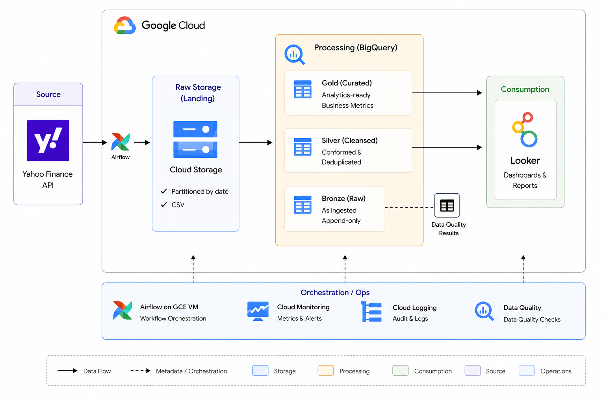
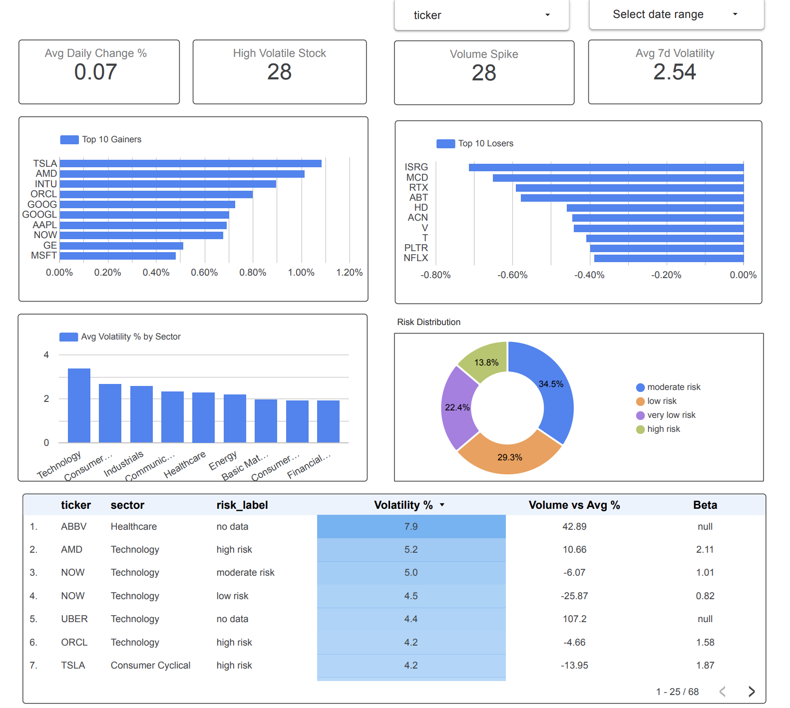

# Financial Data Pipeline

An end-to-end data engineering project built on GCP. Pulls daily stock data for 50 S&P 500 tickers from Yahoo Finance, runs it through a 3 layer BigQuery warehouse, and serves a Looker Studio dashboard for day traders.

Built this to demonstrate production style data engineering across ingestion, transformation, data quality, orchestration and visualization.

**Tech stack:** Python · Apache Airflow · Google Cloud Storage · BigQuery · Looker Studio · GCE VM

---

## Architecture



The pipeline runs on a GCE VM (e2-micro, us-central1). Airflow orchestrates three daily tasks: extract → load → transform. Each task is a standalone Python script running in its own process via BashOperator, which keeps memory usage manageable on a 1 GB VM.

---

## Pipeline layers

**Ingestion**
`extract_from_yahoo.py` pulls OHLCV data and fundamentals (beta, market cap, P/E ratio, sector) for 50 tickers using yfinance. Each run writes a dated CSV to GCS. Idempotent by design: re-running for the same date overwrites the same GCS object.

**Raw layer (BigQuery)**
`load_to_bigquery.py` reads from GCS and appends to `fin_raw.stock_prices_raw`. Before appending it deduplicates on (ticker, date) so re-runs don't create duplicate rows. 27 data quality checks run at this stage and results get written to a `dq_results` audit table on every run.

**Curated layer (BigQuery)**
`transform_curated.py` builds the warehouse:
- `dim_company` — stores company metadata (name, sector, industry, exchange) so fact tables stay lean and attributes aren't repeated across rows
- `fact_daily_prices` — cleaned OHLCV with derived metrics (daily % change, 7-day rolling volatility, volume vs average)
- `fact_weekly_summary` — weekly aggregates per ticker

**Enriched layer (SQL views)**
Four views sit on top of the curated layer for the dashboard:
- `view_stock_performance` — gainers/losers ranked by daily % change
- `view_volatility_analysis` — volatility scores with risk classification
- `view_moving_averages` — 7d and 30d moving averages
- `fact_weekly_summary` — weekly performance summary

---

## Data quality

27 checks run on every load across four categories:

**Schema checks** — all expected columns present, correct data types, no schema drift from the source API

**Null checks** — required fields (ticker, date, open, high, low, close, volume) must be non-null. Fundamentals like beta and market cap are allowed to be null for some tickers

**Price logic checks** — high >= low, close within [low, high] range, volume > 0, prices > 0

**Duplicate detection** — flags if (ticker, date) pairs appear more than once before deduplication runs

All results are written to `dq_results` in BigQuery with check name, status, row counts and a timestamp. Full audit trail across every run.

---

## Orchestration

Airflow DAG (`financial_pipeline`) runs Monday to Friday at 22:00 UTC. Uses Airflow's `{{ ds }}` macro for the processing date so backfills work correctly out of the box.

```
extract_from_yahoo >> load_to_bigquery >> transform_curated
```

Email alerts on task failure. Weekend aware schedule (1-5 cron) so no spurious runs on Saturday or Sunday.

Config is kept out of the DAG file via environment variables (`PIPELINE_PROJECT_DIR`, `PIPELINE_PYTHON_BIN`, `GOOGLE_APPLICATION_CREDENTIALS`, `PIPELINE_ALERT_EMAIL`).

---

## Dashboard



Built in Looker Studio on top of the enriched views. Shows key metrics (avg daily change, high volatility stock count, volume spikes, avg 7-day volatility), top 10 gainers and losers, avg volatility by sector, risk distribution across the ticker universe and a sortable detail table with volatility, volume vs average and beta per ticker.

Filterable by ticker and date range.

---

## Repo structure

```
Financial_Data_Pipeline/
├── pipeline/
│   ├── extract_from_yahoo.py      # ingestion: Yahoo Finance → GCS
│   ├── load_to_bigquery.py        # load + DQ: GCS → BigQuery raw layer
│   └── transform_curated.py       # transform: raw → curated layer
├── dags/
│   └── financial_pipeline_dag.py  # Airflow DAG definition
├── sql/
│   └── enriched_views.sql         # 4 views on top of curated layer
├── architecture/
│   ├── architecture.png           # pipeline architecture diagram
│   └── dashboard.png              # Looker Studio dashboard screenshot
└── docs/
    └── (data quality docs coming)
```

---

## Roadmap

Things I plan to add:

- Move ticker list to an Airflow Variable so it can be changed without touching code
- Expand ticker coverage from 50 to 500 tickers to track the full S&P 500 index
- Anomaly detection on row counts and price movements
- Fundamentals dashboard in Looker Studio (P/E ratio, market cap trends, beta distribution)
